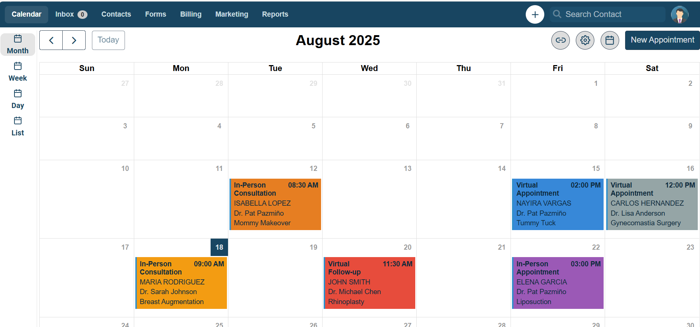

**Note**:\
**15/8/2025**:\
Header và Sidebar : Header chưa có chức năng,Sidebar chưa changeView \
Calendar: Copy từ fullcalendar-examples/react18-typescript, chưa custom \
**18/8/2025**:\
Header: Done(HTML/CSS)\
Sidebar: Done(HTML/CSS và chức năng changeView dùng Redux)\
Em không biết đổi màu icon nên em edit màu trong file svg luôn :))\

Calendar: xong CSS, hiển thị nút, load dữ liệu từ localStorage \
+ Em chưa hiểu cách đánh màu nên để thêm thuộc tính color trong localStorage
+ Em không biết title của event là gì nên nhìn hình rồi gen ra
+ chưa sửa Delete,làm xong form mới làm Create Update

Form:Mới tạo chưa biết nên làm gì\
Thắc mắc:
+ Truyền dữ liệu từ form thế nào?(Redux hay là cách nào khác?)
+ Tự tạo droplist hay add thư viện để tạo ?

\
`npm install`\
`npm run dev`
